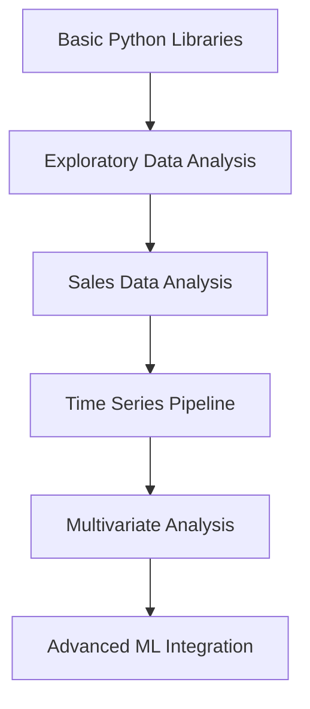

# 📊 Data Analysis & Time Series Project

<div align="center">


*A comprehensive collection of data science workflows for exploratory analysis and time-series modeling*

[📚 Documentation](#documentation) • [🚀 Quick Start](#quick-start) • [📖 Notebooks](#notebooks) • [🔧 Installation](#installation)

</div>

---

## 🎯 Overview

This repository showcases **production-ready data analysis workflows** and **time-series modeling techniques** using Python's most powerful data science ecosystem. Designed for both **learning** and **practical implementation**, it demonstrates industry best practices for:

- 🔍 **Exploratory Data Analysis (EDA)**
- 📈 **Time-Series Preprocessing & Feature Engineering**
- 🔗 **Multivariate Analysis Pipelines**
- 📊 **Advanced Visualization Techniques**

The project follows a **progressive learning path**, from foundational Python libraries to sophisticated temporal analytics for real-world datasets.

## 🏗️ Repository Structure

```
📦 Data-Analysis-Time-Series-Project/
├── 📓 basic_python_Libraries.ipynb
├── 📓 exploratory_data_analysis.ipynb
├── 📓 eda_on_sales_data.ipynb
├── 📓 time_series_data_analysis_pipeline.ipynb
├── 📓 multivariate_time_series_analysis.ipynb
├── 📋 requirements.txt
├── 📄 README.md

```

## 📖 Notebooks

### 🐍 **1. Basic Python Libraries**
> **File:** `basic_python_Libraries.ipynb`

**Foundation toolkit for data science:**
- **NumPy:** High-performance numerical computations
- **Pandas:** Data manipulation and analysis
- **Matplotlib & Seaborn:** Statistical visualization fundamentals
- **Practical examples** with real datasets

### 🔍 **2. Exploratory Data Analysis** 
> **File:** `exploratory_data_analysis.ipynb`

**Complete EDA workflow for structured datasets:**
- ✅ Data quality assessment & cleaning
- 📊 Descriptive statistics & distribution analysis
- 🕳️ Missing value detection & treatment strategies
- 🔗 Correlation analysis with heatmaps
- 📈 Advanced visualization techniques

### 💰 **3. Sales Data Analysis**
> **File:** `eda_on_sales_data.ipynb`

**Business-focused analytics on sales datasets:**
- 📅 Seasonal trend analysis
- 👥 Customer segmentation insights  
- 🛍️ Product performance evaluation
- 💡 Revenue driver identification
- 🚨 Outlier detection & business impact analysis

### ⏰ **4. Time Series Analysis Pipeline**
> **File:** `time_series_data_analysis_pipeline.ipynb`

**End-to-end time-series preprocessing:**
- 🔧 Feature engineering (lags, rolling statistics, differencing)
- 📊 Stationarity testing (ADF, KPSS tests)
- 📅 Seasonal decomposition
- ✂️ Train/validation/test splitting strategies
- 🎯 Model preparation for forecasting algorithms

### 📊 **5. Multivariate Time Series Analysis**
> **File:** `multivariate_time_series_analysis.ipynb`

**Advanced multi-dimensional temporal analysis:**
- 🔗 Cross-correlation analysis between variables
- 🏗️ Multivariate feature engineering
- 🎨 Advanced visualization for high-dimensional data
- 🤖 ML-ready data transformation pipelines

## ✨ Key Features & Highlights

| Feature | Description |
|---------|-------------|
| 🏭 **Industry-Ready Workflows** | Production-grade code following data science best practices |
| 🔄 **Modular & Reproducible** | Clean, documented code structure for easy scaling |
| 📊 **Visualization-Driven** | Rich interactive plots and statistical graphics |
| ⚡ **Performance Optimized** | Efficient pandas operations and vectorized computations |
| 🧪 **Real-World Datasets** | Handles messy data, missing values, and edge cases |
| 🤖 **ML Pipeline Ready** | Seamlessly integrates with scikit-learn, TensorFlow, PyTorch |

## 🛠️ Tech Stack

<div align="center">

| Category | Technologies |
|----------|-------------|
| **Language** |  |
| **Data Manipulation** |   |
| **Visualization** |   |
| **Time Series** |  |
| **Environment** |  |

</div>

## 🚀 Quick Start

### 📋 Prerequisites
- Python 3.8 or higher
- Jupyter Notebook or JupyterLab
- Git (for cloning)

### 🔧 Installation

1. **Clone the repository**
   ```bash
   git clone https://github.com/your-username/data-analysis-time-series-project.git
   cd data-analysis-time-series-project
   ```

2. **Create virtual environment** (recommended)
   ```bash
   python -m venv venv
   source venv/bin/activate  # On Windows: venv\Scripts\activate
   ```

3. **Install dependencies**
   ```bash
   pip install -r requirements.txt
   ```

4. **Launch Jupyter Notebook**
   ```bash
   jupyter notebook
   ```

5. **Start exploring!** 🎉
   Begin with `basic_python_Libraries.ipynb` and progress through the notebooks sequentially.

## 📋 Requirements

```txt
numpy>=1.21.0
pandas>=1.3.0
matplotlib>=3.4.0
seaborn>=0.11.0
statsmodels>=0.12.0
scipy>=1.7.0
jupyter>=1.0.0
plotly>=5.0.0
scikit-learn>=1.0.0
```

## 📊 Sample Outputs

<details>
<summary>🖼️ Click to see example visualizations</summary>

- **Correlation Heatmaps** with advanced styling
- **Time Series Decomposition** plots
- **Interactive Sales Dashboards**
- **Multi-dimensional Feature Correlation**
- **Statistical Distribution Analysis**

</details>

## 🗺️ Learning Path



## 🔮 Future Enhancements

- [ ] 🤖 **ML Model Integration** (Prophet, LSTM, XGBoost forecasting)
- [ ] 🔍 **Automated Feature Selection** for multivariate time series
- [ ] 🚀 **Model Deployment Scripts** (Flask/FastAPI endpoints)
- [ ] 📱 **Interactive Dashboards** (Plotly Dash, Streamlit)
- [ ] ☁️ **Cloud Integration** (AWS, GCP, Azure)
- [ ] 🧪 **A/B Testing Framework** for business analytics
- [ ] 📊 **Real-time Data Pipeline** (Apache Kafka, Airflow)

## 🤝 Contributing

Contributions are welcome! Please feel free to submit a Pull Request. For major changes, please open an issue first to discuss what you would like to change.

1. Fork the Project
2. Create your Feature Branch (`git checkout -b feature/AmazingFeature`)
3. Commit your Changes (`git commit -m 'Add some AmazingFeature'`)
4. Push to the Branch (`git push origin feature/AmazingFeature`)
5. Open a Pull Request

## 📄 Documentation

For detailed documentation on each notebook and methodology, please refer to the inline comments and markdown cells within each Jupyter notebook.

## 👨‍💻 Author

<div align="center">

**Paras Sharma**  
*Penultimate-year student at IIT Kanpur*

[](https://www.linkedin.com/in/paras-sharma-429820253/)
[](mailto:paras1301sharma@gmail.com)

*Passionate about **data-driven problem-solving**, **time-series modeling**, and **AI applications***

</div>

## 📜 License

This project is licensed under the MIT License - see the [LICENSE](LICENSE) file for details.

---

<div align="center">

**⭐ If you found this project helpful, please consider giving it a star!**

*Made with ❤️ and lots of ☕ by Paras Sharma*

</div>
